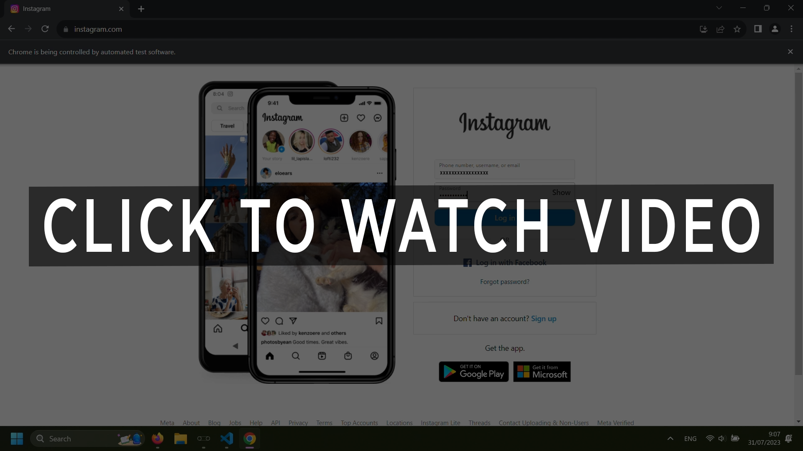

# Terima Kasih
Terima kasih kepada PT Data Labs Analytics yang telah memberikan kesempatan kepada kami untuk dapat melaksanakan Internship di tempat ini. Berikut merupakan repository dokumentasi proyek saya dengan rekan saya Renata Valencia yaitu mengambil data Instagram dengan teknik Web Scraping. 

# Instagram Web Scraping With Selenium


[](ig-web-scraping-demo.mp4)

Proyek ini adalah proyek intern saya yaitu scraping instagram web menggunakan Anaconda `Python 3.9.12` dan `Selenium 3.141.0`. Script untuk scraping berada di file `scratch_selenium.ipynb`. Script scraping ini mampu mengambil informasi dari data publik dari profike instagram orang, seperti jumlah posting, jumlah followers, jumlah following dan lain-lain. 


Ada beberapa hal yang perlu diperhatikan ketika menjalankan ini. Pastikan Anda menonton video demo scraping instagram yang berada di directory yang sama. Teknik scraping yang saya gunakan tidak hanya Selenium, tetapi beberapa melalui hidden API dari instagram. Juga menggunakan script `keyboard` dan `mouse` yang mana script tersebut akan beraksi seperti layaknya kita menggunakan keyboard dan mouse secara fisik. 

> Perlu ditekankan, ketika hendak menjalankan script, jangan melakukan interupsi input berupa menggerakkan mouse, menggunakan keyboard, berpindah tab aplikasi. 

> Please note that web scraping may be against Instagram's terms of service, so use this script responsibly and consider the legal implications.


## Prerequisites
```py
!pip install selenium==3.141.0
!pip install webdriver-manager
!pip install requests==2.30.0
!pip install pygame
!pip install keyboard
!pip install mouse
```
Untuk dapat melakukan Web Scraping, Anda perlu mendownload Chrome Driver (untuk kasus ini, saya melakukan scraping menggunakan Google Chrome). Lalu kemudian, letakkan pada lokasi berikut:
```
C:/SeleniumDrivers/chromedriver.exe
```

Silahkan membuat file baru di system `C:` dengan nama `SeleniumDrivers`.
Download versi Chrome Driver yang sesuai dengan versi Google Chrome Anda.<br>

Download Chrome Driver:<br>
https://chromedriver.chromium.org/downloads

Cek versi Google Chrome:<br>
https://www.lifewire.com/check-version-of-chrome-5222040


## How to Run
Untuk menjalankan script, Anda memerlukan akun Instagram dan mempersiapkan `username` & `password`. Saya sarankan akun yang kosong (fake) karena jika menggunakan akun IG Anda yang asli MUNGKIN dapat menyebabkan akun Anda terblokir atau hal lain yang tak diinginkan. Lalu kemudian untuk menjalankan script ini harus menggunakan VS Code dengan ukuran yang sesuai dengan yang ada di video.
1. Install requirement library
2. Download Chrome Driver
3. Put the Chrome Driver on this path `C:/SeleniumDrivers/chromedriver.exe`
4. You can edit or choose which instagram user you want to scrape, by edit it in variable `list_username`.
5. Open `scratch_selenium.ipynb` and `ig_feed_responses.json` sequentially (do not open any other files)
6. Set the VS Code and 4th position on your taskbar, so it's able to press `win + 4` and the Chrome on 5th `win + 5`.
7. It's safe to click `run all`


## How It Works?


## Disclaimer
Saya menggunakan resolusi layar 1920x1080. Mungkin di beberapa komputer tidak bisa di execute, pastikan versi-versi nya sesuai. Juga beberapa resolusi mempengaruhi keberhasilan script. Jika terdapat missclick oleh script/program, Anda dapat mengganti posisi/koordinat cursor pada variable `position` yaitu sebuah dictionary. Untuk mendapatkan posisi cursor, anda dapat memanggil fungsi `get_mouse_position()`.
